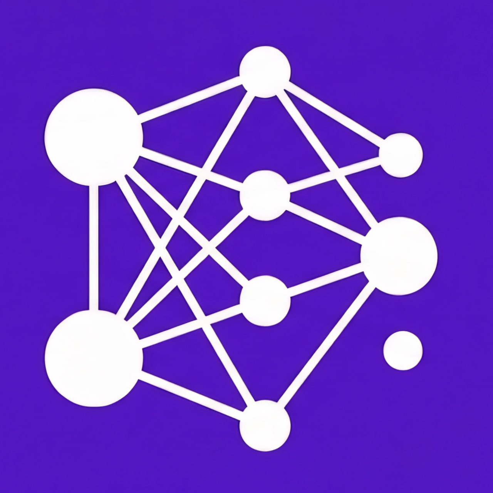

# AI4SWE
### AI Engineering for Software Engineers — End-to-End Crash Course Series

<br/>

<table align="center" border="0" cellpadding="16">
<tr>
<td align="center">
<br/><br/>
<b>Musab Khunaijir</b><br/>
<a href="https://t.me/musab_khunaijir">📡 t.me/musab_khunaijir</a>
</td>
<td align="center" width="80">
<h2>✕</h2>
</td>
<td align="center">
<br/><br/>
<b>SAiR</b><br/>
<a href="https://t.me/+jPPlO6ZFDbtlYzU0">📡 t.me/SAiR</a>
</td>
</tr>
</table>

<br/>

<p align="center">
  
  
  
  
</p>

<p align="center">
  <i>A joint production — two channels, two directions, one complete picture of AI engineering.</i>
</p>

---

## TL;DR

> You already know how to code. This series teaches you how to **think about AI systems** — from the right terminology, through the full stack, all the way to building agents.
>
> Top-down. Technically honest. Built for engineers, not beginners.

---

## What You'll Be Able To Do

By the end of this series you will be able to:

- Use every AI term correctly — LLM, RAG, agent, inference, embedding — and know exactly which layer of the stack it belongs to
- Read any AI paper, doc, or architecture diagram and understand what it's actually saying
- Build RAG pipelines, agentic systems, and LLM-powered features from scratch
- Work with open-source models locally via HuggingFace and Ollama
- Integrate and build tools over MCP
- Choose the right abstraction level for any AI task — prompt vs API vs open-source vs agent
- Reason about AI costs, latency, and architectural tradeoffs like an engineer

---

## What Is This?

AI4SWE is an **end-to-end AI engineering guide** built specifically for software engineers who already know how to code — and want to understand AI systems the right way.

Not a surface-level overview. Not a marketing story. A technically honest, top-down walkthrough of modern AI — from correct terminology and historical context, through the full model stack, all the way to building production AI systems.

The goal: engineers who can reason clearly about the full stack — from a chat interface all the way down to the model, the inference runtime, and the hardware beneath it.

---

## Who Is This For?

**This is for you if:**
- You write code professionally and are comfortable with CS fundamentals
- You keep hearing LLM, RAG, agents, fine-tuning — and want the real definitions, not the marketing ones
- You've been asked to "add AI" to a system and want to make informed architectural decisions
- You want a structured path from terminology to building real AI-powered systems

**This is NOT for you if:**
- You're new to programming — start with coding basics first
- You want a no-code AI tools walkthrough — this goes into the engineering

---

## Two Channels, Two Approaches

This series is a joint collaboration between two channels that cover the same AI engineering landscape from **opposite directions** — designed to complement each other.

<table>
<thead>
<tr><th></th><th>🧭 AI4SWE — Musab</th><th>⚗️ SAiR</th></tr>
</thead>
<tbody>
<tr><td><b>Direction</b></td><td>Top-down</td><td>Bottom-up</td></tr>
<tr><td><b>Starts with</b></td><td>The full system map</td><td>First principles & fundamentals</td></tr>
<tr><td><b>Flow</b></td><td>Terminology → Stack → Build</td><td>Theory → Foundations → Application</td></tr>
<tr><td><b>Best for</b></td><td>Engineers who want the big picture fast</td><td>Engineers who want deep theoretical grounding</td></tr>
<tr><td><b>Telegram</b></td><td><a href="https://t.me/musab_khunaijir">t.me/musab_khunaijir</a></td><td><a href="https://t.me/+jPPlO6ZFDbtlYzU0">t.me/SAiR</a></td></tr>
</tbody>
</table>

> Follow both for the complete picture. Start with whichever direction resonates with how you learn.

---

## The Approach

**Top-down.** The full map comes first — terminology, history, the stack — before going deep on any single topic. Every lecture tells you *why this exists* before *how it works*.

**Technically rich.** Analogies are grounded in CS concepts you already know. Depth is calibrated for engineers, not product managers.

**Layered.** Modern AI is a stack. Every lecture is explicit about which layer it's operating at — product, API, model, systems, or hardware — and what that means for the decisions you make.

**Build-oriented.** By the end of the series, you're not just familiar with AI concepts — you're equipped to build, evaluate, and reason about AI systems end-to-end.

---

## Curriculum

| # | Lecture | Topics | Status |
|---|---------|--------|--------|
| 01 | [From AI to Agents: The Complete Terminology Map](#lecture-1) | AI history, terminology, LLM stack, abstraction layers | ✅ Ready |
| 02 | [Context & Prompt Engineering](#lecture-2) | CE vs PE, mental model, 5 patterns, workflow, failure diagnosis, prompt injection | ✅ Ready |
| 03 | LLMs Under the Hood | Tokens, inference, context windows, decoding, embeddings | 🔜 Upcoming |
| 04 | Open-Source LLMs | HuggingFace, Ollama, running models locally | 🔜 Upcoming |
| 05 | RAG & Vector Databases | Retrieval pipelines, chunking, semantic search | 🔜 Upcoming |
| 06 | MCP | Model Context Protocol — tools, servers, integrations | 🔜 Upcoming |
| 07 | Agents | Tools, memory, decision loops, orchestration | 🗓 Planned |

---

## Lectures

<a name="lecture-1"></a>
### Lecture 01 — From AI to Agents: The Complete Terminology Map

> *Fix your lingo before you build anything.*

Every term a software engineer needs — from AI to inference to agents — placed in the right layer, with the right definition, grounded in the historical context that produced them.

**Covers:** AI history (symbolic → ML → DL → transformers) · Full terminology (14 terms) · The 5-layer LLM stack · The AI → Agent taxonomy · How to answer "add AI to this feature"

| Resource | Link |
|---|---|
| 📊 Slide Deck | [`lecture1.jsx`](./1-Introduction%20and%20Terms/lecture1.jsx) |
| 🌐 Interactive Artifact | [Open in Claude](https://claude.ai/public/artifacts/9c2cd345-6c4c-408c-a2a1-9857f7037b98) |
| 🌳 AI Tree | [Open in Claude](https://claude.ai/public/artifacts/301ea686-a15e-4e2f-9f34-9954e32c6fc9) |
| 🌳 Bigger AI Tree | [Open in Claude](https://claude.ai/public/artifacts/da67e768-2b50-4c64-b0eb-35aff2a27d1a) |
| 🗺 Excalidraw Diagram | [`Lecture_1.excalidraw`](./1-Introduction%20and%20Terms/Lecture_1.excalidraw) |
| 🎬 Recording | *(coming soon)* |

**Demos:**

| # | File | What it shows | Setup |
|---|------|--------------|-------|
| 01 | [`01_the_ui_is_just_an_api_call.py`](./1-Introduction%20and%20Terms/demos/01_the_ui_is_just_an_api_call.py) | The chat UI is just an API call — same request, no browser | `uv add groq python-dotenv` |
| 02 | [`02_api_parms.py`](./1-Introduction%20and%20Terms/demos/02_api_parms.py) | Key API params: system message, temperature, max_tokens | `uv add groq python-dotenv` |
| 03 | [`03_tokens_are_not_words.py`](./1-Introduction%20and%20Terms/demos/03_tokens_are_not_words.py) | Tokens ≠ words — BPE in action, English vs Arabic | `uv add tiktoken` · no API key needed |
| 04 | [`bonus_api.py`](./1-Introduction%20and%20Terms/demos/bonus_api.py) | Same request pattern across Anthropic and OpenAI SDKs | `uv sync` (already in pyproject.toml) |

```bash
# setup once
uv add groq tiktoken python-dotenv

# add to .env
GROQ_API_KEY=your_key
```

<a name="lecture-2"></a>
### Lecture 02 — Context & Prompt Engineering

> *The context window is everything the model knows. Your job is to fill it right.*

Reframes "prompt engineering" as a subdomain of context engineering — the full discipline of managing everything that enters the context window. Covers the five patterns that handle 90% of real engineering work, the systematic workflow that turns guesswork into a repeatable process, and when prompting is not the right tool.

**Covers:** CE > PE framing · Mental model (stateless function, context window) · Three message roles · 5 core patterns (zero-shot, few-shot, CoT, structured output, role/persona) · Prompt development workflow · Failure mode diagnosis · The ceiling (RAG, fine-tuning, agents)

| Resource | Link |
|---|---|
| 📊 Slide Deck | [`lecture2.jsx`](./2_Prompt_Eng/lecture2.jsx) |
| 🌐 Interactive Artifact | *(link in video description)* |
| 🎬 Recording | *(coming soon — YouTube)* |

**Demos:**

| # | File | What it shows |
|---|------|--------------|
| 01 | [`01_context_is_everything.py`](./2_Prompt_Eng/demos/01_context_is_everything.py) | Same question, 3 system prompts → 3 completely different outputs |
| 02 | [`02_zero_vs_few_shot.py`](./2_Prompt_Eng/demos/02_zero_vs_few_shot.py) | Zero-shot → 1-shot → 3-shot with token cost tracked per variant |
| 03 | [`03_chain_of_thought.py`](./2_Prompt_Eng/demos/03_chain_of_thought.py) | No CoT (wrong) → zero-shot CoT (correct) → hidden CoT (correct, clean) |
| 04 | [`04_structured_output.py`](./2_Prompt_Eng/demos/04_structured_output.py) | Prose output → JSON schema → server-side validation |
| 05 | [`05_stateless_memory.py`](./2_Prompt_Eng/demos/05_stateless_memory.py) | Statelessness proved live; history injection fixes it; chatbot loop |
| 06 | [`06_combining_patterns.py`](./2_Prompt_Eng/demos/06_combining_patterns.py) | All 5 patterns in one production pipeline: role + few-shot + CoT + JSON |
| 07 | [`07_the_ceiling.py`](./2_Prompt_Eng/demos/07_the_ceiling.py) | Model hallucinates private data; simulated RAG fixes it; decision tree |
| 08 | [`08_prompt_injection.py`](./2_Prompt_Eng/demos/08_prompt_injection.py) | 4 injection techniques + prompt-level defense + intent classifier |
| Bonus | [`bonus_prompt_workflow.py`](./2_Prompt_Eng/demos/bonus_prompt_workflow.py) | Semantic failure: framing fools the model — 3/6 → 5/6 → 6/6 |

```bash
# No new setup needed — same GROQ_API_KEY from Lecture 1
cd 2_Prompt_Eng/demos
python3 01_context_is_everything.py
```

---

## Setup

```bash
# clone the repo
git clone https://github.com/SAIR-Org/AI4SWE.git
cd AI4SWE

# install all dependencies
uv sync

# add your API keys
cp .env.example .env
# then fill in your keys in .env
```

**.env format:**
```
GROQ_API_KEY=your_key
ANTHROPIC_API_KEY=your_key
OPENAI_API_KEY=your_key
```

---

## Format

Each lecture is released on YouTube and accompanied by this repo. The format:
- Conceptual framing — the why before the how
- Live demos on real APIs — code you can run yourself
- Interactive reference artifacts published alongside each video
- Full source in this repo — clone and follow along

---

## Where to Watch

| Channel | Link |
|---|---|
| 🎬 YouTube — AI4SWE (Musab) | *(coming soon)* |
| 🎬 YouTube — SAiR | *(coming soon)* |
| 📡 Telegram — Musab | [t.me/musab_khunaijir](https://t.me/musab_khunaijir) |
| 📡 Telegram — SAiR | [t.me/SAiR](https://t.me/+jPPlO6ZFDbtlYzU0) |

---

## Status

🟢 **Active** — series in progress. New lectures added as they are recorded.  
Subscribe on YouTube or follow the Telegram channels for release announcements.
